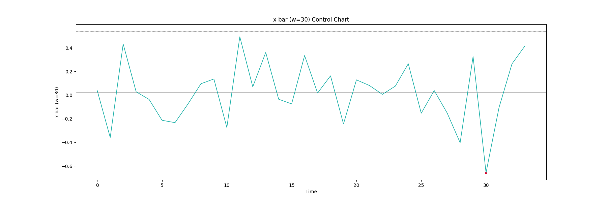

# control_chart

This is a simple Shewhart chart implementation for univariate statistical process control.
The current version has the following statistics
- `x_bar`: x-bar
- `S`: S
- `R`: R
- `ma`: moving average
More will be added.

A simple usage is as follows.
```python
# make a training dataset that is assumed to be in-control
X = np.random.randn(500)
# make instance of desired statistics with subsample size (n)
my_stat = x_bar(n=30)
# make instance of control chart with desired control limit width (L)
my_chart = shewhart_chart(stat=my_stat, L=3)
# fit control chart
my_chart.fit(X)
# generate new process variables
X_new = np.random.normal(0, 1.2, 1000)
# run control chart
my_chart.run(X_new)
# show control chart
ccplot(my_chart, X_new)
```
The resulting control chart is as follows.

